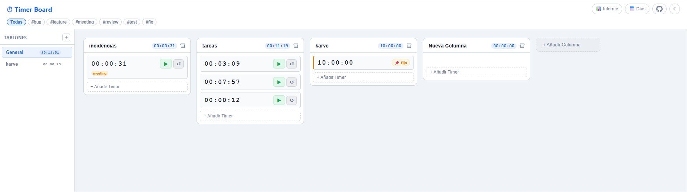
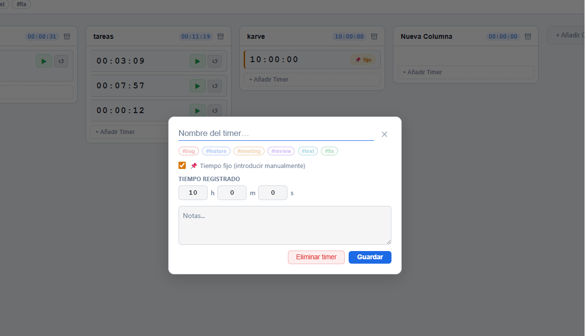
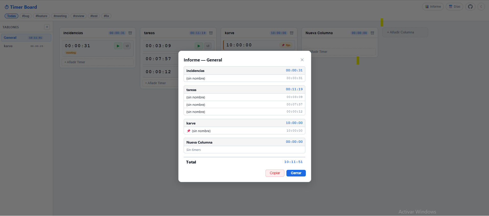
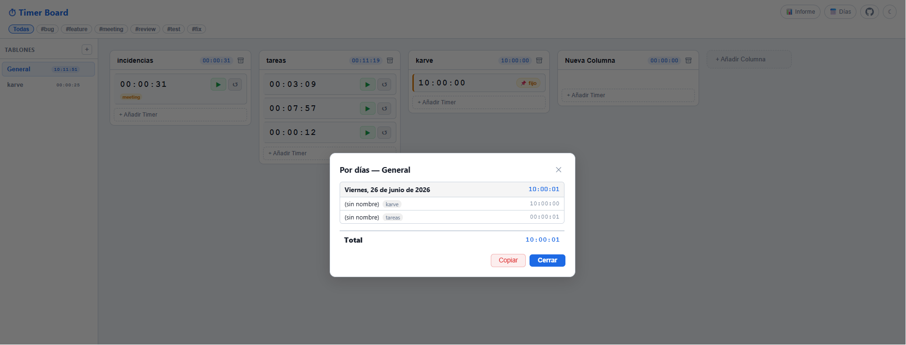

# ⏱ Timer Board

Tablero estilo **Kanban** para controlar el tiempo dedicado a tareas y proyectos. Cada columna agrupa timers que puedes arrancar, parar y reiniciar, con totales por columna y por tablón, etiquetas, filtros e informes.

Aplicación **estática**: HTML, CSS y JavaScript puro. Sin dependencias, sin paso de compilación.

🔗 **Demo en vivo:** https://jfarres-dev.github.io/Timers/

## ✨ Características

- **Múltiples tablones** — organiza proyectos independientes desde la barra lateral, cada uno con su total acumulado.
- **Columnas y timers** — crea columnas (proyectos/fases) y dentro timers para cada tarea.
- **Cronómetros** — arranca ▶ / para ⏹ / reinicia ↺ cada timer. El tiempo se guarda automáticamente.
- **Tiempo fijo** — convierte cualquier timer en una entrada de tiempo manual desde su configuración (📌), introduciendo las horas a mano.
- **Etiquetas y filtros** — clasifica con `#bug`, `#feature`, `#meeting`, `#review`, `#test`, `#fix` y filtra el tablero por etiqueta.
- **Informes**:
  - **📊 Informe** — desglose de horas por columna y timer del tablón (solo columnas activas).
  - **📅 Días** — desglose de las horas por día, para ver cuándo se hizo cada trabajo.
  - Ambos se pueden **copiar** al portapapeles como texto plano.
- **Arrastrar y soltar** — reordena timers y columnas, o mueve timers entre columnas.
- **Archivar columnas** — guarda columnas terminadas sin perder su tiempo; quedan fuera de los totales e informes.
- **Modo claro / oscuro** — con conmutador en la cabecera.
- **Persistencia local** — todo se guarda en `localStorage` del navegador; no hay servidor ni cuentas.
- **Responsive** — adaptado a escritorio, tablet y móvil.

## 🚀 Uso local

No necesita compilación. Abre `index.html` directamente en el navegador, o sirve la carpeta con cualquier servidor estático:

```bash
# Python
python -m http.server

# o Node
npx serve
```

Luego abre `http://localhost:8000` (o el puerto que indique).

## 🖼 Capturas

| Tablero | Configuración de timer |
|---|---|
|  |  |

| Informe por columnas | Informe por días |
|---|---|
|  |  |

## 🗂 Estructura del proyecto

```
Timers/
├── index.html          # Maquetación y modales
├── css/style.css       # Estilos y temas (variables CSS)
├── js/app.js           # Toda la lógica de la aplicación
├── assets/             # Favicon y capturas
└── .github/workflows/  # Despliegue a GitHub Pages
```

## 💾 Datos

El estado se guarda en `localStorage` bajo la clave `timerboard`. A grandes rasgos:

```js
{
  boards: [
    {
      id, title,
      columns: [
        {
          id, title, archived,
          cards: [
            { id, title, elapsed, running, notes, tags, type, daily }
          ]
        }
      ]
    }
  ],
  activeBoardId
}
```

- `elapsed` — total de segundos del timer.
- `type` — `"timer"` (cronómetro) o `"static"` (tiempo fijo manual).
- `daily` — reparto de segundos por día (`{ "YYYY-MM-DD": segundos }`), base del informe por días.

> El historial por días se registra a partir del momento en que se usa esta versión; el tiempo acumulado anterior no tiene fecha asociada.

## ☁️ Despliegue

Cada `push` a `master` despliega automáticamente a **GitHub Pages** mediante [`.github/workflows/static.yml`](.github/workflows/static.yml).

## 📄 Licencia

Uso libre. Adáptalo a tus necesidades.
